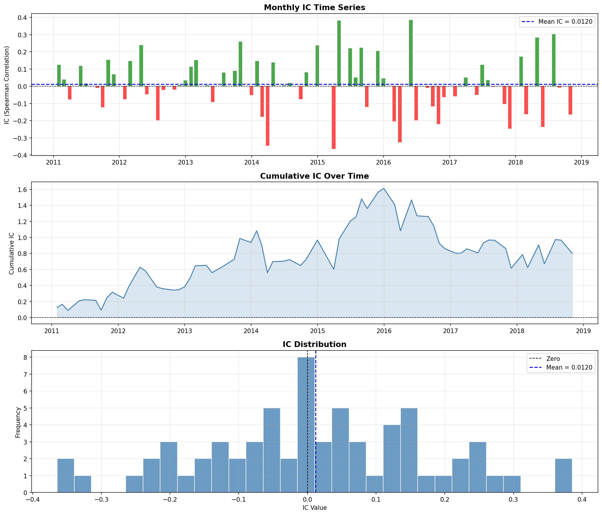
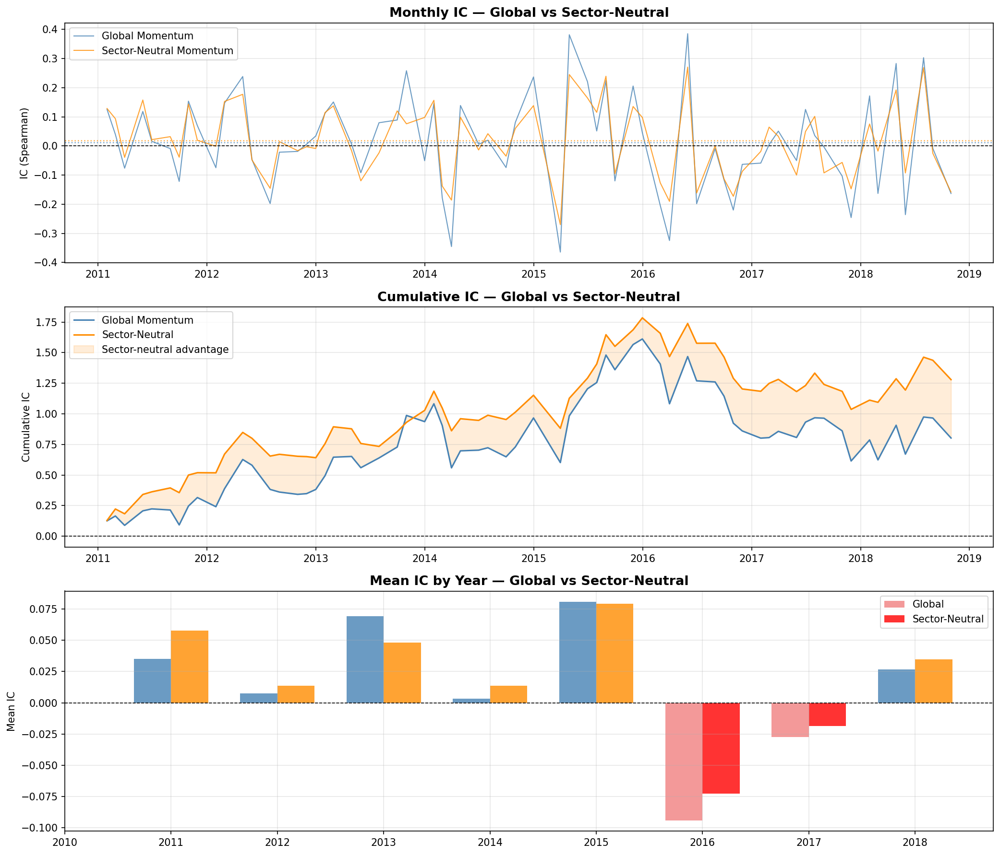
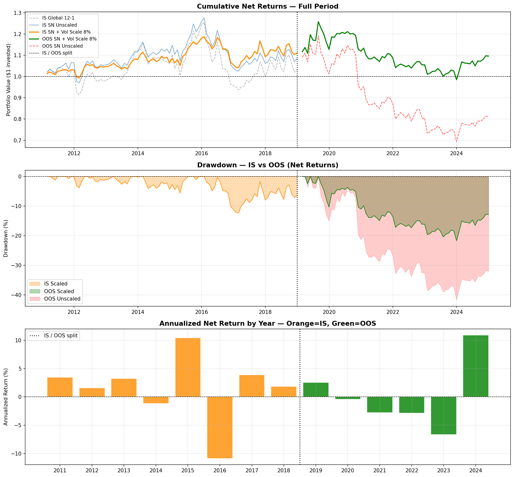
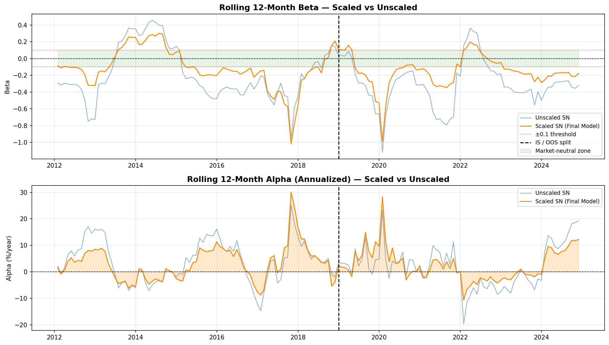

# Momentum Alpha Signal

A systematic quantitative research project replicating and extending
the cross-sectional momentum factor on S&P 500 equities, following
the methodology of Jegadeesh & Titman (1993).

---

## Overview

Starting from the canonical 12-1 momentum specification, this research
develops a series of methodologically motivated improvements:

1. **Sector-neutral ranking** — removes sector rotation contamination,
   improving ICIR by +116%
2. **Volatility scaling** — reduces momentum crash exposure,
   improving IS Sharpe by +88% and max drawdown by -37%

The signal maintains genuine predictive power out-of-sample
(IC = +0.024, Hit Rate = 65.3%) across a structurally different
market regime (2019–2024).

---

## Key Results

| Variant | Net Sharpe IS | Max DD IS | IC OOS | Hit Rate OOS |
|---|---|---|---|---|
| Global 12-1 (baseline) | 0.037 | -25.3% | — | — |
| Sector-Neutral 12-1 | 0.120 | -19.6% | — | — |
| **SN + Vol Scaling 8%** | **0.226** | **-12.3%** | **+0.024** | **65.3%** |

---

## Research Pipeline

```
01 Data Collection
      ↓
02 Signal Construction
      ↓
03 IC Analysis ──→ 03b Parameter Stability ──→ 03c Sector-Neutral
      ↓
04 Backtesting ──→ 04b Global vs SN ──→ 04c Holding Period ──→ 04d Vol Scaling + Model Selection
      ↓
05 Out-of-Sample Test
      ↓
06 Risk Analysis (CAPM + Fama-French)
      ↓
Research Memo
```

---

## Notebooks

| # | Notebook | Description | Colab |
|---|---|---|---|
| 01 | Data Collection | S&P 500 price download, quality checks, cleaning | [](https://colab.research.google.com/github/lorenzo-tinivella/momentum-alpha-signal/blob/main/notebooks/01_data_collection.ipynb) |
| 02 | Signal Construction | 12-1 momentum signal, cross-sectional ranking, quintile assignment | [](https://colab.research.google.com/github/lorenzo-tinivella/momentum-alpha-signal/blob/main/notebooks/02_signal_construction.ipynb) |
| 03 | IC Analysis | Spearman IC time series, ICIR, hit rate, statistical significance | [](https://colab.research.google.com/github/lorenzo-tinivella/momentum-alpha-signal/blob/main/notebooks/03_ic_analysis.ipynb) |
| 03b | Signal Variations | Grid search over lookback × holding period, stability analysis | [](https://colab.research.google.com/github/lorenzo-tinivella/momentum-alpha-signal/blob/main/notebooks/03b_signal_variations.ipynb) |
| 03c | Sector-Neutral Momentum | Within-sector ranking, IC comparison vs global signal | [](https://colab.research.google.com/github/lorenzo-tinivella/momentum-alpha-signal/blob/main/notebooks/03c_sector_neutral.ipynb) |
| 04 | Backtesting | Long/short portfolio, transaction costs, performance metrics | [](https://colab.research.google.com/github/lorenzo-tinivella/momentum-alpha-signal/blob/main/notebooks/04_backtesting.ipynb) |
| 04b | Global vs Sector-Neutral | Side-by-side backtest comparison, turnover analysis | [](https://colab.research.google.com/github/lorenzo-tinivella/momentum-alpha-signal/blob/main/notebooks/04b_backtesting_sector_neutral.ipynb) |
| 04c | Holding Period Sensitivity | Net Sharpe vs K = {1,2,3,4} months, cost drag analysis | [](https://colab.research.google.com/github/lorenzo-tinivella/momentum-alpha-signal/blob/main/notebooks/04c_holding_period_sensitivity.ipynb) |
| 04d | Volatility Scaling + Model Selection | Moreira & Muir (2017) vol scaling, final IS model comparison | [](https://colab.research.google.com/github/lorenzo-tinivella/momentum-alpha-signal/blob/main/notebooks/04d_volatility_scaling.ipynb) |
| 05 | Out-of-Sample Test | Final model applied to 2019–2024, IC + portfolio performance | [](https://colab.research.google.com/github/lorenzo-tinivella/momentum-alpha-signal/blob/main/notebooks/05_out_of_sample.ipynb) |
| 06 | Risk Analysis | CAPM, Fama-French 3-factor, rolling beta, alpha decomposition | [](https://colab.research.google.com/github/lorenzo-tinivella/momentum-alpha-signal/blob/main/notebooks/06_risk_analysis.ipynb) |

> For best rendering, view notebooks via the Colab links above.

---

## Selected Charts

### Signal Quality — IC Analysis


### Sector-Neutral vs Global — IC Comparison


### Final Model — Cumulative Returns (Full Period)


### Risk Decomposition — Rolling Beta


---

## Final Model Specification

| Component | Specification |
|---|---|
| Signal | 12-1 month momentum (252d formation, 21d skip) |
| Ranking | Sector-neutral within GICS sectors |
| Portfolio | Equal-weight dollar-neutral long/short (Q5 − Q1) |
| Rebalancing | Monthly (K=1) |
| Vol scaling | Target 8%, 21-day window, max weight 2.0x |
| Transaction costs | 5 bps/trade + 0.5% annual borrow fee |

---

## Methodology Notes

**Train/Test Split:**
- In-sample: 2011-01-01 → 2018-12-31 (model development)
- Out-of-sample: 2019-01-01 → 2024-12-30 (examined once)

**Survivorship bias:** universe is based on current S&P 500
composition. Historical delistings are not included — results
should be interpreted with this limitation in mind.

**Statistical power:** with 95 IS and 71 OOS monthly observations,
alpha estimates of 1-3%/year are not statistically significant
at the 95% level. ~200+ observations would be required.

---

## Project Structure

```
momentum-alpha-signal/
├── notebooks/          ← analysis notebooks (01–06)
├── src/
│   ├── data.py         ← data download and cleaning
│   ├── signals.py      ← momentum signal construction
│   ├── backtest.py     ← portfolio construction and costs
│   └── metrics.py      ← IC, Sharpe, drawdown metrics
├── data/
│   ├── README.md       ← how to regenerate parquet files
│   └── *.png           ← pre-generated charts
├── report/
│   └── research_memo.md ← full research findings
└── requirements.txt
```

---

## Stack

Python · pandas · numpy · scipy · statsmodels · yfinance · matplotlib

---

## Research Memo

Full research findings, methodology, and conclusions:
[→ Read the Research Memo](report/research_memo.md)

---

## References

- Jegadeesh & Titman (1993) — *Returns to Buying Winners and Selling Losers*
- Fama & French (1993) — *Common Risk Factors in Stock and Bond Returns*
- Moskowitz & Grinblatt (1999) — *Do Industries Explain Momentum?*
- Moreira & Muir (2017) — *Volatility-Managed Portfolios*
- Daniel & Moskowitz (2016) — *Momentum Crashes*